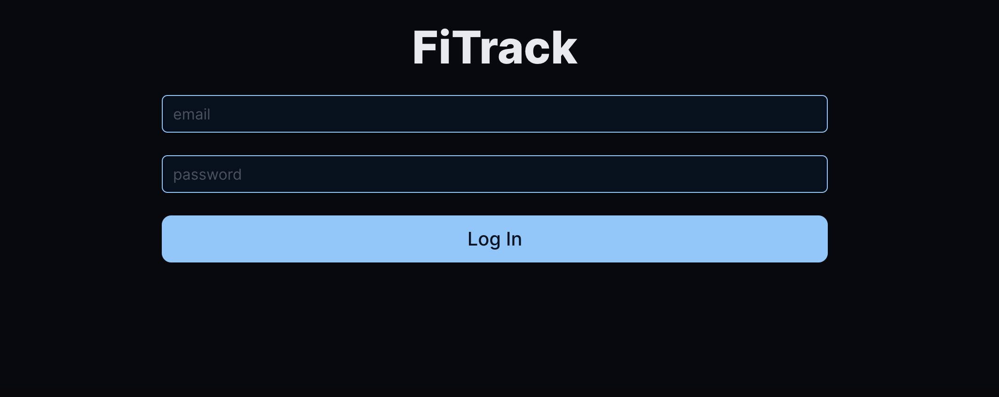
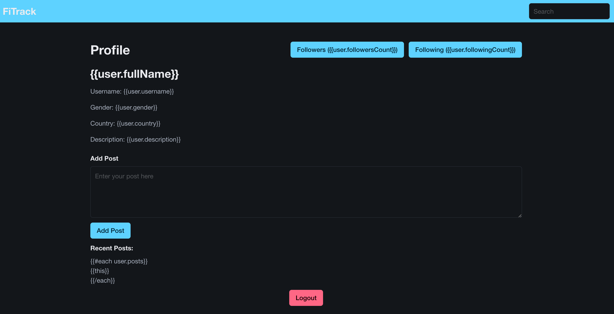
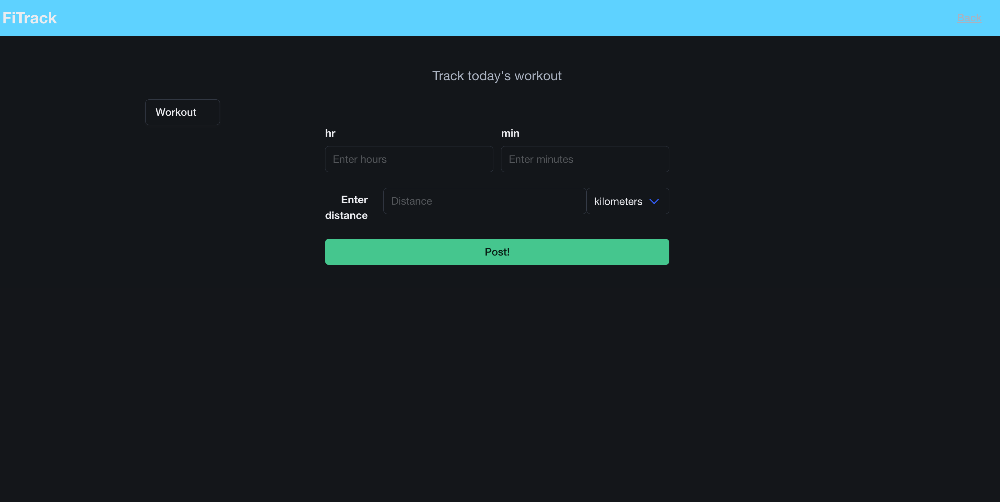

# FiTrack

## Description

This is a webpage designed for endurance athletes, especially those interested in the triathlon sports (swimming / running / biking), of any background and level where they can share their achievements with other users, comment on other user's posts, follow and have followers from other athletes, but most importantly keep track of one's own performance over time!

[Click here to view the deployed webpage](https://fi-track-f3175d32f96f.herokuapp.com/) 📑

## Table of Contents

* [Installation](#installation)
* [Usage](#usage)
* [Credits](#credits)
* [License](#license)

## Installation

[Just click here to go to the the deployed website!](https://fi-track-f3175d32f96f.herokuapp.com/) 🌎

## Usage

1. Open the webpage link provided in either the [Description](#description) or [Installation](#installation) section of this `README.md` file
2. You will be directed to the login screen

3. Create an account
4. Sign-up with a valid email address (this is because a 'Welcome' Email will be sent)
5. You can choose to edit your profile information on Sign-up or complete it later
6. Once done, you will see the Profile page

7. From this page you will be able to create posts, view your followers, see the people who follows you and go to their own profile to see their posts, and also make your own posts. This is the most important part of the webpage since the 'Add Post' button will be the beginning of your training journal

## Credits

This project was created with the help of:
* The _Chat GPT_ AI developed by __Open AI__.
* The _Xpert Learning Assistant_ AI developed by __edX__.
* Our coding instructor, [Marco Monter](https://github.com/montermarco).
* Various resources from coding documentation, YouTube videos, and forums.

This project was created by:
* [Maria Corona](https://github.com/m13corona) - Front-end
* [Julio Gallegos](https://github.com/juliogallegosv) - Front-end
* [Logan McDaniel](https://github.com/lsmcd) - Back-end
* [Marcos Munoz](https://github.com/marcusmr15) - Back-end

## License

MIT License
